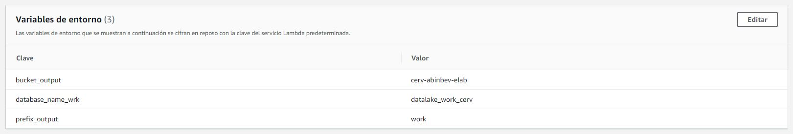

# datalake_bpc PROYECTO FINAL


## Lambda generador de trigger de envento del datalake


### Configurar variables de entorno de lambda

Estas variables de entorno se configuran en el lambda:

    
```

bucket_output = cerv-abinbev-elab

database_name_wrk = datalake_work_cerv

prefix_output = work
```
